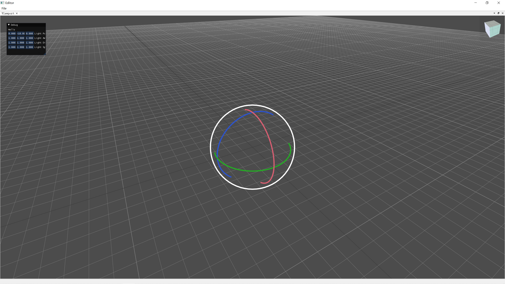

# Stone
Stone Engine

# clone
```bash
git clone https://github.com/StoneHappy/Stone.git --recursive
```

## dependency
Before building, install``qt5``和``qt-advanced-docking-system`` by ``vcpkg``
```bash
vcpkg install qt5:x64-windows qt-advanced-docking-system:x64-windows
```

## how to build
```bash
cd Stone

mkdir build

cd build 

cmake .. -DCMAKE_TOOLCHAIN_FILE=path to/vcpkg.cmake -DVCPKG_TARGET_TRIPLET=your target triplet

cmake --build ./ --config Release --target StoneEditor -j 10
```

## screenshot
